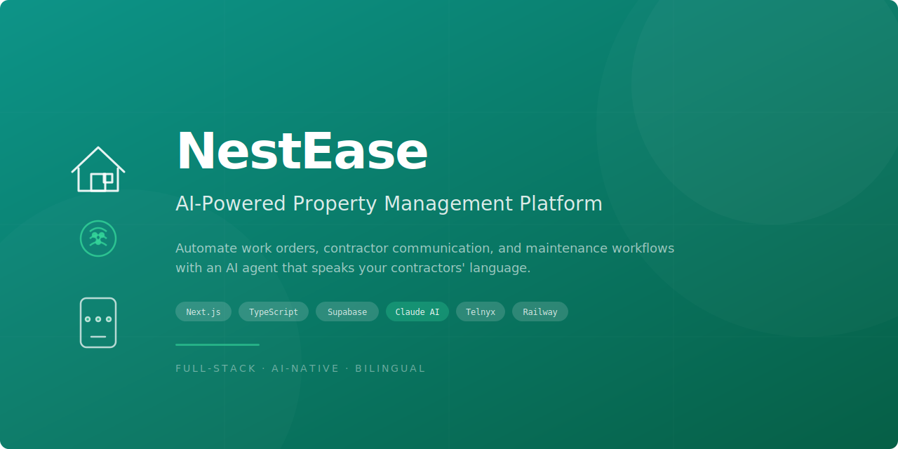
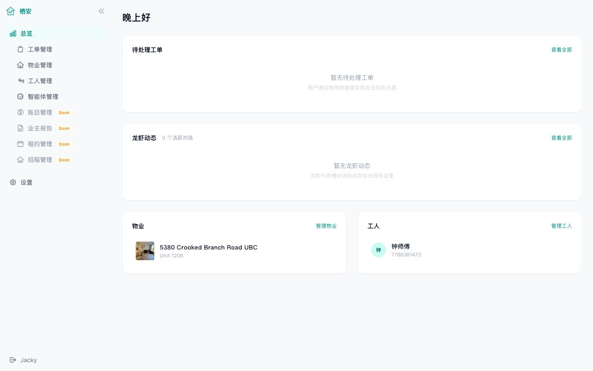
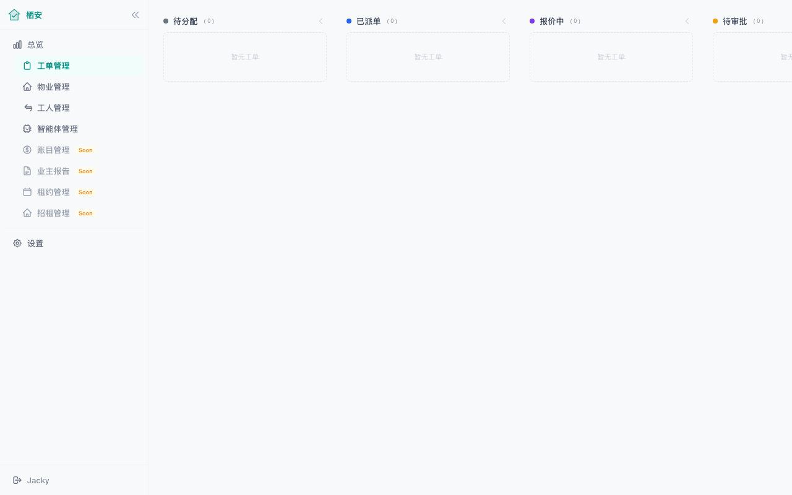
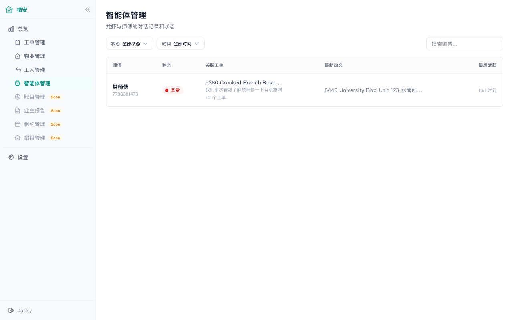
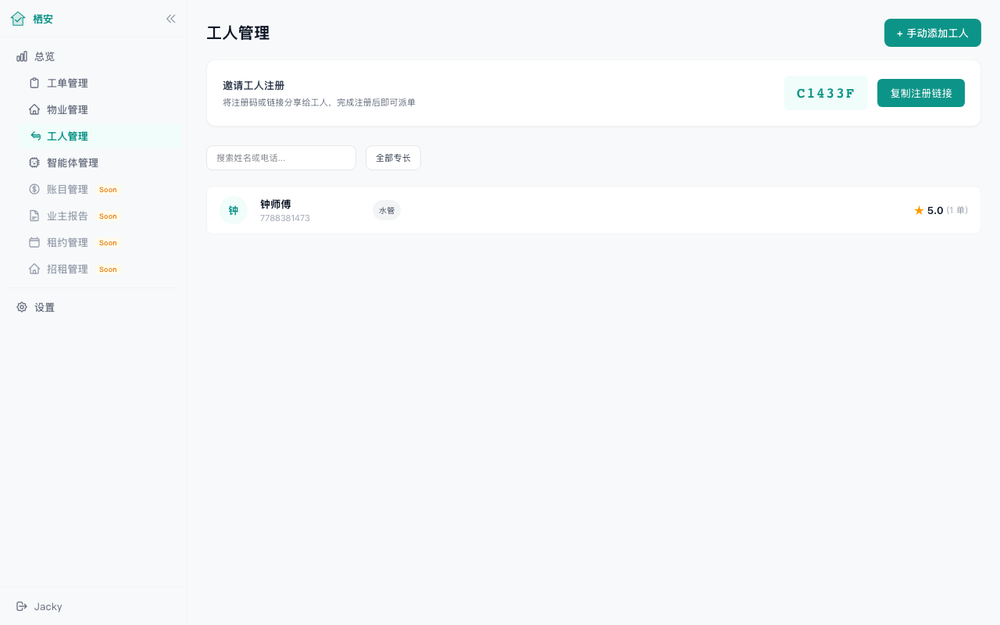
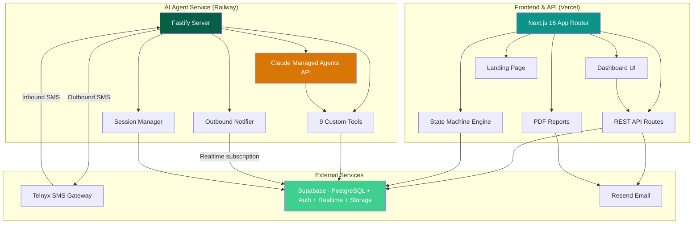

<p align="center">
  
</p>

<p align="center">
  <a href="#tech-stack"></a>
  <a href="#tech-stack"></a>
  <a href="#tech-stack"></a>
  <a href="#tech-stack"></a>
  <a href="#tech-stack"></a>
  <a href="#tech-stack"></a>
  <a href="#tech-stack"></a>
  <a href="#tech-stack"></a>
</p>

---

## Problem

Property managers in Vancouver's rental market coordinate maintenance across dozens of contractors via phone calls and text messages in multiple languages. The workflow is manual: dispatch a work order, wait for a quote, get owner approval, track completion, verify the work. Every step requires back-and-forth communication, often in both English and Chinese.

Contractors don't use apps. They're driving between jobs and communicate via SMS. Existing property management software assumes everyone will log in to a web portal, which doesn't match reality.

## Solution

NestEase is an AI-native property management platform that automates the entire maintenance workflow through an AI agent that communicates with contractors via SMS in their preferred language (Chinese/English).

The AI agent handles:
- Dispatching work orders and collecting contractor responses
- Guiding contractors through quoting (labor, materials, timeline)
- Notifying contractors of approvals, rejections, and cancellations
- Collecting completion photos and notes
- Escalating issues to the property manager when needed

The PM manages everything from a web dashboard without making a single phone call.

## How It Works

```
Tenant submits          PM dispatches           AI Agent texts            Contractor
repair request    ->    work order on      ->   contractor via SMS   ->   accepts, quotes,
via web link            dashboard               (bilingual, natural       completes work
                                                language)
                                    |
                        Owner approves/rejects quote via email
                                    |
                        PM monitors everything on dashboard
```

**End-to-end flow:**
1. Tenant reports issue via a permanent repair link (per-property, no login needed)
2. PM sees it on the dashboard, assigns a contractor with one click
3. AI agent texts the contractor: "Hey, there's a new job at [address]. Leaky faucet. Can you take it?"
4. Contractor replies via SMS, agent guides them through quoting
5. Quote goes to owner for approval (email with signed link)
6. Owner approves -> agent notifies contractor to start work
7. Contractor finishes, sends photos via SMS -> agent collects completion report
8. PM verifies on dashboard -> done

## Screenshots

<p align="center">
  
  <br><em>PM Dashboard: work order overview, agent activity, property stats</em>
</p>

<p align="center">
  
  <br><em>Kanban board: drag-and-drop work order management with status columns</em>
</p>

<p align="center">
  
  <br><em>AI Agent management: monitor all contractor conversations and session status</em>
</p>

<p align="center">
  
  <br><em>Contractor management: specialties, ratings, and invite codes</em>
</p>

## Architecture



### Key Architecture Decisions

| Decision | Rationale |
|----------|-----------|
| **Per-PM Agent instances** | Claude Managed Agents API doesn't support per-session prompt override; each PM gets their own agent with tailored system prompt |
| **Persistent sessions** | One session per contractor-PM pair, never expires. Claude handles context compaction automatically |
| **Database-level dedup** | Partial unique index + atomic UPDATE prevents duplicate SMS during zero-downtime deploys |
| **HMAC-SHA256 signed URLs** | External users (tenants, owners) access the system via cryptographically signed links, no login required |
| **State machine with side effects** | 7 work order states with validated transitions, automatic notifications, and optimistic locking |

## Tech Stack

### Frontend & API (`/nestease`)

| Layer | Technology |
|-------|-----------|
| Framework | Next.js 16 (App Router, Turbopack) |
| Language | TypeScript 5.x |
| Styling | Tailwind CSS v4 + Design Tokens |
| Database | Supabase (PostgreSQL + Auth + Storage + Realtime) |
| Email | Resend (approval notifications, completion reports) |
| PDF | Server-side HTML rendering with @media print |
| Drag & Drop | @dnd-kit (Kanban board) |
| Testing | Vitest (unit) + Playwright (E2E) |
| Deployment | Vercel |

### AI Agent Service (`/nestease-agent`)

| Layer | Technology |
|-------|-----------|
| Runtime | Node.js + Fastify |
| AI | Claude Managed Agents API (@anthropic-ai/sdk) |
| SMS | Telnyx SDK v6 (bidirectional SMS + MMS) |
| Database | Supabase (shared with main app) |
| Deployment | Railway (zero-downtime rolling deploys) |

### AI Agent Tools (9 custom tools)

| Tool | Purpose |
|------|---------|
| `get_work_order` | Fetch work order details |
| `list_work_orders` | List contractor's active work orders |
| `accept_work_order` | Accept a dispatched job |
| `submit_quote` | Submit itemized quote (labor hours x rate, materials, timeline) |
| `submit_completion` | Submit completion report with photos |
| `notify_pm` | Escalate issues to the property manager |
| `confirm_identity` | First-time contractor identity verification |
| `save_memory` | Persist contractor preferences and context |
| `get_memories` | Retrieve saved contractor context |

## Database Schema

15 migrations managing these core tables:

- `pm` / `owner` / `tenant` / `contractor` - Multi-role user management
- `property` - Properties with photo storage and permanent repair links
- `work_order` - 7-state FSM with optimistic locking
- `work_order_status_history` - Full audit trail with atomic dedup flag
- `quote` - Itemized quotes (labor, materials, other costs)
- `completion_report` - Completion data with photo references
- `notification` - Multi-channel notification tracking
- `agent_sessions` - AI agent session management (partial unique index)
- `agent_conversation_log` - Full conversation audit trail
- `agent_memories` - Contractor preference persistence
- `leads` - Landing page lead capture

## Security

- **Dual authentication**: Supabase Auth (JWT) for PMs, HMAC-SHA256 signed URLs for external users
- **Row Level Security**: Supabase RLS policies enforce data isolation per PM
- **PM ownership verification**: All API routes validate PM owns the requested resource
- **No secrets in code**: All credentials via environment variables with startup validation
- **Atomic dedup**: PostgreSQL row-level locking prevents duplicate notifications during deploys
- **Partial unique index**: Database constraint prevents duplicate active sessions

## Project Structure

```
nestease-portfolio/
├── nestease/                    # Next.js main application
│   ├── src/
│   │   ├── app/                 # App Router pages & API routes
│   │   │   ├── api/             # REST API (work-orders, contractors, properties, leads)
│   │   │   └── dashboard/       # PM dashboard pages
│   │   ├── components/          # React components (sidebar, landing, UI)
│   │   ├── lib/                 # Shared utilities (auth, SMS, PDF, state machine)
│   │   └── services/            # Business logic (state machine, side effects)
│   ├── supabase/migrations/     # 15 SQL migrations
│   └── e2e/                     # Playwright E2E tests
│
├── nestease-agent/              # AI Agent service
│   ├── src/
│   │   ├── agent/               # Core agent logic
│   │   │   ├── session-manager.ts    # Session lifecycle + dedup
│   │   │   ├── outbound-notifier.ts  # Realtime event → SMS notifications
│   │   │   ├── tool-definitions.ts   # 9 custom tool schemas
│   │   │   └── tool-handlers.ts      # Tool implementation logic
│   │   ├── sms/                 # Telnyx webhook + SMS sender
│   │   └── lib/                 # Supabase client, phone normalization
│   └── tests/                   # Scenario-based integration tests
│
└── docs/                        # Screenshots and documentation
```

## Setup

### Prerequisites

- Node.js 20+
- Supabase project (free tier works)
- Telnyx account with SMS-enabled number
- Anthropic API key (Claude Managed Agents access)
- Resend account (for email notifications)

### Main Application (`/nestease`)

```bash
cd nestease
cp .env.example .env.local
# Fill in your Supabase, Telnyx, and Resend credentials
npm install
npx supabase db push    # Apply migrations
npm run dev              # http://localhost:3000
```

### AI Agent Service (`/nestease-agent`)

```bash
cd nestease-agent
cp .env.example .env
# Fill in your Anthropic, Supabase, and Telnyx credentials
npm install
npm run build
npm start                # http://localhost:3001
```

### Telnyx Webhook

Point your Telnyx messaging profile webhook to:
```
https://your-agent-url/webhook/sms
```

## License

MIT
