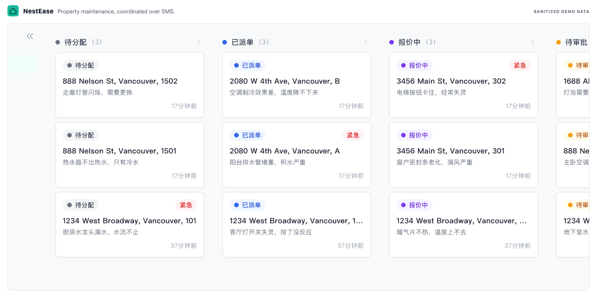
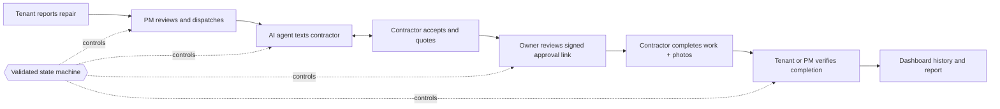
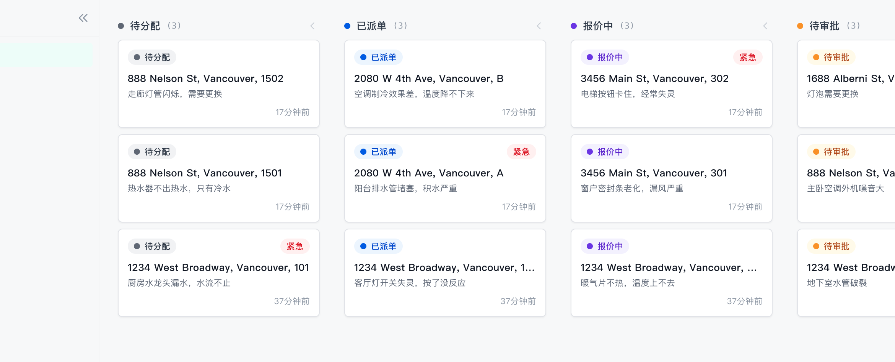
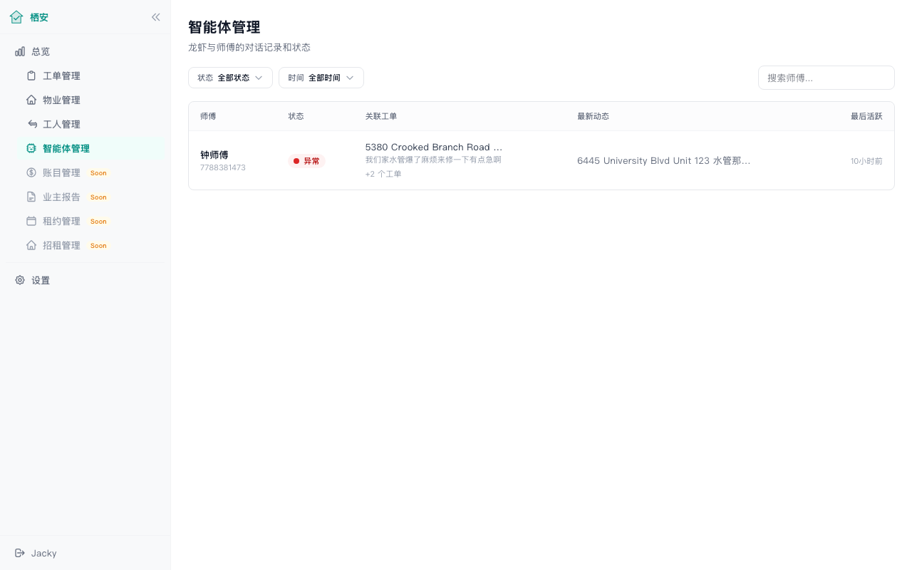
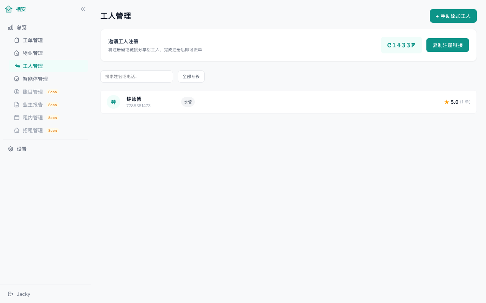
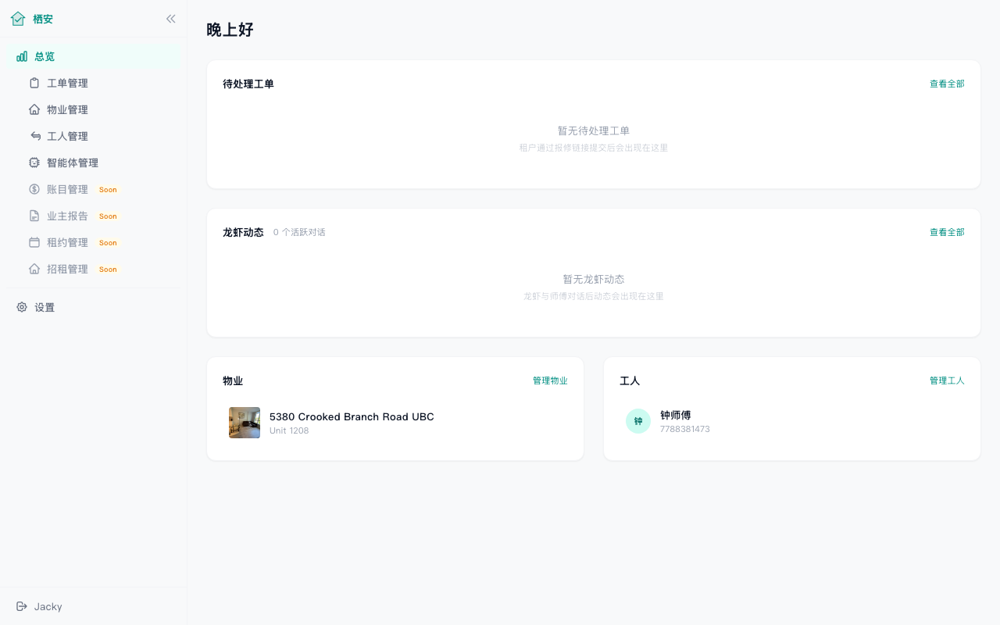
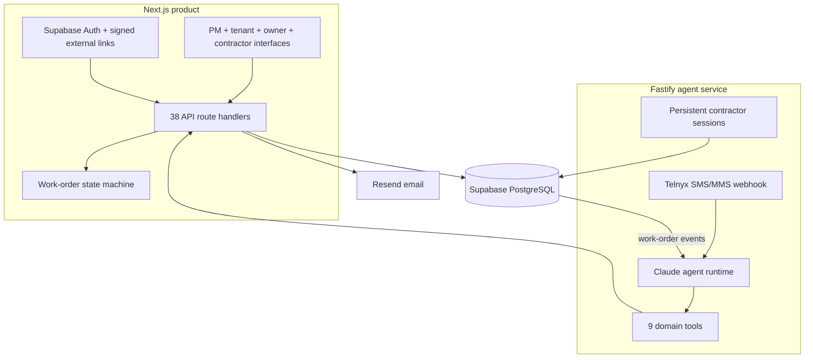

<div align="center">

# NestEase

**AI-native maintenance coordination for property managers working with contractors who live in SMS—not another portal.**

NestEase turns a repair request into a controlled workflow: dispatch, bilingual contractor conversation, structured quote, owner approval, completion evidence, and tenant verification.

</div>



> The product UI is from the repository's demo workspace. The SMS conversation is a sanitized composite based on implemented agent prompts and tools; it contains no production messages or customer data.

<p align="center">
  
  
  
  
</p>

## Why this is more than a CRUD dashboard

Property maintenance is a multi-party coordination problem. Tenants report issues, property managers dispatch work, contractors quote and complete jobs, owners approve costs, and tenants verify the result. Most contractors are already reachable by text, so NestEase puts the AI at that boundary and keeps human decisions visible in the dashboard.

| Verified proof point | What exists in the codebase |
| --- | --- |
| **Tool-using AI agent** | 9 domain tools for identity, work-order lookup, acceptance, quoting, completion, escalation, and memory—not a free-form chatbot |
| **Controlled business workflow** | 9 work-order states with 29 allowed transition edges, validation, side effects, hold/resume, rejection, follow-up, and auto-approval paths |
| **Full product surface** | 38 API route handlers, 12 dashboard pages, 15 database migrations, and 36 unit/integration/E2E test files across two deployable services |

## What I engineered

- **A bilingual, tool-driven contractor agent.** The agent can switch between Chinese and English, retrieve current work-order context, collect itemized quotes, require confirmation before writes, receive MMS completion photos, and escalate uncertainty to a property manager.
- **A stateful maintenance engine.** One transition layer validates the lifecycle from `pending_assignment` through approval, work, verification, completion, cancellation, and hold/resume while emitting auditable side effects.
- **Purpose-built interfaces for four roles.** Property managers use the dashboard; contractors work through SMS or a lightweight authenticated portal; owners approve through expiring signed links; tenants submit and verify without creating an account.
- **Operational safeguards.** The code includes persistent agent sessions, database-backed notification deduplication, optimistic workflow checks, HMAC-signed external links, server-side cost calculation, and ownership-aware API handlers.
- **A tested two-service system.** The Next.js product and Fastify agent service share the same Supabase model, with Vitest, Playwright, mocked-SMS flows, and real-database E2E coverage where credentials are available.

## One maintenance loop


```mermaid
flowchart LR
    T[Tenant reports repair] --> PM[PM reviews and dispatches]
    PM --> AI[AI agent texts contractor]
    AI <--> C[Contractor accepts and quotes]
    C --> O[Owner reviews signed approval link]
    O --> C2[Contractor completes work + photos]
    C2 --> V[Tenant or PM verifies completion]
    V --> D[Dashboard history and report]

    SM{{Validated state machine}} -. controls .-> PM
    SM -. controls .-> AI
    SM -. controls .-> O
    SM -. controls .-> V
```

The agent handles communication and structured data collection. It does **not** make owner approval decisions or silently advance high-impact actions; those decisions remain explicit workflow transitions.

## Product tour

<table>
  <tr>
    <td width="50%"></td>
    <td width="50%"></td>
  </tr>
  <tr>
    <td><strong>Work-order control plane</strong><br>Track assignment, quoting, approval, work, and verification without losing the operational handoff.</td>
    <td><strong>Agent observability</strong><br>Monitor contractor sessions, linked work orders, and exceptional conversations from the PM dashboard.</td>
  </tr>
  <tr>
    <td></td>
    <td></td>
  </tr>
  <tr>
    <td><strong>Contractor operations</strong><br>Manage specialties, assignments, notes, ratings, and work history.</td>
    <td><strong>Portfolio overview</strong><br>See the work that needs attention alongside properties, contractors, and agent activity.</td>
  </tr>
</table>

<sub>All screenshots show demo content. Names, numbers, addresses, and conversations should be replaced with synthetic data before public demos.</sub>

## System design


```mermaid
graph TB
    subgraph Product[Next.js product]
        UI[PM + tenant + owner + contractor interfaces]
        API[38 API route handlers]
        FSM[Work-order state machine]
        AUTH[Supabase Auth + signed external links]
    end

    subgraph Agent[Fastify agent service]
        WEBHOOK[Telnyx SMS/MMS webhook]
        RUNTIME[Claude agent runtime]
        TOOLS[9 domain tools]
        SESSIONS[Persistent contractor sessions]
    end

    DB[(Supabase PostgreSQL)]
    EMAIL[Resend email]

    UI --> API
    API --> FSM
    API --> DB
    API --> EMAIL
    WEBHOOK --> RUNTIME
    RUNTIME --> TOOLS
    TOOLS --> API
    SESSIONS --> DB
    DB -->|work-order events| RUNTIME
    AUTH --> API
```

### Deliberate engineering choices

| Choice | Why it matters |
| --- | --- |
| **Domain tools instead of unrestricted agent writes** | Each action has typed input, preconditions, and explicit confirmation requirements. |
| **State machine as the workflow authority** | Invalid transitions fail closed instead of relying on UI order or model judgment. |
| **One active session per PM–contractor pair** | Conversations keep operational context while a partial unique index prevents duplicate active sessions. |
| **Database-backed outbound deduplication** | Rolling deploys and realtime reconnects do not intentionally send the same notification twice. |
| **Signed, expiring links for external actors** | Owners and tenants can take narrow actions without receiving permanent dashboard accounts. |

## Verified implementation snapshot

These numbers are derived from the checked-in source, not product claims:

| Surface | Count | Source |
| --- | ---: | --- |
| AI domain tools | **9** | [`tool-definitions.ts`](nestease-agent/src/agent/tool-definitions.ts) |
| Work-order states | **9** | [`types/index.ts`](nestease/src/types/index.ts) |
| Allowed transition edges | **29** | [`VALID_TRANSITIONS`](nestease/src/types/index.ts) |
| Next.js API route handlers | **38** | [`src/app/api`](nestease/src/app/api) |
| Dashboard pages | **12** | [`src/app/dashboard`](nestease/src/app/dashboard) |
| Database migrations | **15** | [`supabase/migrations`](nestease/supabase/migrations) |
| Automated test files | **36** | [`src/__tests__`](nestease/src/__tests__) + [`e2e`](nestease/e2e) |

## Technology

| Product application | Agent service |
| --- | --- |
| Next.js 16, React 19, TypeScript 5 | Node.js, Fastify 5, TypeScript 5 |
| Tailwind CSS 4, dnd-kit | Claude via `@anthropic-ai/sdk` |
| Supabase Auth, PostgreSQL, Realtime, Storage | Telnyx SMS/MMS + WebSocket support |
| Resend email, server-rendered PDF reports | Shared Supabase data model |
| Vitest + Playwright | Scenario-based validation scripts |

## Project status

NestEase is a **portfolio MVP and engineering prototype**, not a production property-management service. The repository contains the implemented UI, API, workflow engine, agent service, database migrations, and automated tests. Running the complete flow requires your own Supabase, Anthropic, Telnyx, and Resend credentials.

- The screenshots and hero use demo or sanitized content; they are not evidence of a live customer deployment.
- The 36 test files document substantial intended coverage, but this repository snapshot does not currently have a fully green test/lint/type-check baseline; no passing-CI claim is made here.
- There is no uptime commitment, third-party security audit, or production support policy.
- Several dashboard modules are visibly marked `Soon`; the maintenance workflow is the implemented product core.
- Before handling real properties or people, complete a privacy review, threat model, retention policy, vendor review, and production authorization audit.

## Security and privacy

Implemented controls include Supabase authentication for property managers, HMAC-SHA256 contractor sessions, expiring signed links for owner/tenant actions, timing-safe signature comparison, environment-based secrets, request authentication helpers, and selected RLS/storage policies in the migrations.

Important deployment responsibilities:

- The server uses a Supabase service-role client for backend operations, which can bypass RLS. Route-level authentication, ownership checks, and authorization tests are therefore critical controls and should be audited before production use.
- Work orders can contain names, phone numbers, addresses, repair photos, quotes, and conversation logs. Use synthetic data in demos and define retention/deletion rules before collecting real data.
- Review data processing and retention across Anthropic, Telnyx, Supabase, Resend, Vercel, and Railway for the jurisdiction where the system is deployed.
- Rotate `LINK_SIGNING_SECRET`, `CONTRACTOR_JWT_SECRET`, service-role keys, and internal API keys through a managed secret store; never commit them.

See [`SECURITY.md`](SECURITY.md) for responsible disclosure and the project's current security boundary.

## Run locally

### Prerequisites

- Node.js 20+
- A Supabase project and Supabase CLI
- Anthropic, Telnyx, and Resend credentials for the complete integrated flow

### 1. Product application

```bash
cd nestease
cp .env.example .env.local
# Fill in the required values in .env.local
npm ci
npx supabase db push
npm run dev
```

The application starts at <http://localhost:3000>.

### 2. Agent service

```bash
cd nestease-agent
cp .env.example .env
# Fill in the required values in .env
npm ci
npm run build
npm start
```

The agent service defaults to <http://localhost:3001>. Point the Telnyx messaging-profile webhook at `https://your-agent-host/webhook/sms`.

## Tests

```bash
cd nestease
npm ci
npm test -- --run
npm run lint
npm run build
npx playwright test
```

Unit tests use mocks where appropriate. Tests labeled `real` and full browser/integration flows require the relevant database or external-service environment.

## Repository layout

```text
.
├── nestease/                  # Next.js product, API, state machine, migrations, tests
│   ├── src/app/               # Role-specific pages and 38 API route handlers
│   ├── src/services/          # Validated workflow transitions
│   ├── src/__tests__/         # Unit and integration tests
│   ├── e2e/                   # Playwright journeys
│   └── supabase/migrations/   # 15 schema and reliability migrations
├── nestease-agent/            # Fastify AI/SMS service
│   ├── src/agent/             # Prompt, sessions, tools, handlers, outbound events
│   └── src/sms/               # Telnyx webhook and sender
└── docs/                      # Product screenshots and README visuals
```

## License

[MIT](LICENSE) © 2026 Jacky Zhong
